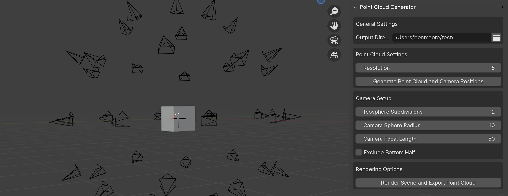

# Point Cloud Generator

Point Cloud Generator is a Blender addon designed to generate point clouds and reference camera poses from meshes. It utilizes colors sampled from rendered frames, which can be used in NeRF or 3D-Gaussian reconstruction processes.

**Supports Blender 4.0 and higher.** This is a work in progress.

## Features

-   Generate point clouds from selected mesh objects.
-   Automatically create camera setups around the object(s) of interest.
-   Export generated point clouds in PLY format with associated colors.

## Installation

1. Clone or download the repository source.
2. Open Blender and navigate to `Edit > Preferences > Add-ons`.
3. Click on `Install` and select the `point_cloud_generator.py` file.
4. Enable the addon by checking the box next to its name.

## Usage

To use the Point Cloud Generator, follow these steps:

1. Open your project in Blender.
2. Select the mesh objects you want to generate a point cloud from.
3. Navigate to the `Tool` panel in the `3D View`.
4. Expand the `Point Cloud Generatory` section.
5. Adjust the settings according to your needs (resolution, camera setup, etc.).
6. Click on `Generate Point Cloud and Camera Positions` to create the point cloud and camera poses.
7. Use the `Render Scene and Export Point Cloud` to process and export the final data.

## Configuration

The addon offers several configurable settings:

-   **Resolution**: Controls the number of points per unit area.
-   **Camera Settings**: Allows customization of camera count, position, and focal lengths.
-   **Output Path**: Directory where the outputs (PLY files, rendered images) will be stored.
